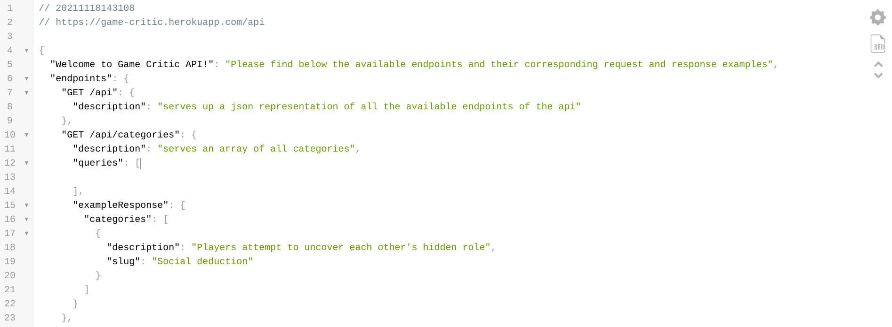

# Game Critic API


## Project Summary

This API was built for the purpose of accessing application data programmatically. Mimicking the building of a real world backend service which should provide this information to the front end of architecture.

The database is **_PSQL_** and is interacted with using **_node-postgres_**

&ensp; 
## Visit the API [hosted in Heroku](https://game-critic.herokuapp.com/api/)

The main endpoint serves up an index of all the available endpoints in the api and their corresponding request and response examples.

&ensp; 


&ensp; 
## How to run it locally
&ensp; 
### Clone

```
 $ git clone https://github.com/CelinaPlatt/games-api.git
```
```
$ cd games-api
```
&ensp; 
### Install dependencies

All necessary dependencies are added in the package.json. To install simply type on the command line the following:

```
 $ npm install
```
&ensp; 
### Create .env files

On the main directory create the following two files with their corresponding content.Then add them to .`gitignore`.

`.env.development`

```
PGDATABASE=nc_games
```

`.env.development`

```
PGDATABASE=nc_games_test
```
&ensp; 
### Seed local database
The following script will run the setup.sql file to create both the development and the test databases.
```
$ npm run setup-dbs  
```
The next script will run the seed.js file to populate the appropriate database.
```
$ npm run seed 
```
&ensp; 
## Run Tests

The next command will run all the tests with `jest`.

```
$ npm test 
```
&ensp; 
#### Minimun version of `Node.js`

v16.5.0

#### Minimum version of `Postgres`

psql (PostgreSQL) 12.8


